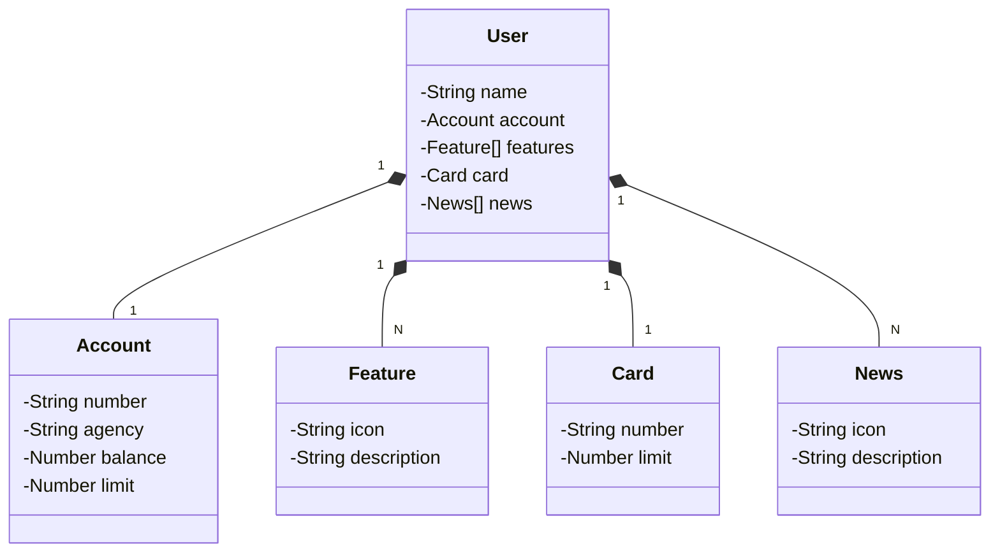

# Santander Dev Backend JAVA 2025 (Didactic Fork)

Java RESTful API created for Santander Dev Week, **forked and adapted with a didactic focus** to demonstrate backend concepts and best practices.

## Features

This fork introduces and emphasizes the following functionalities:

- **Account Management:**  
  Robust `Account` entity with validation, constructors, and utility methods for safe and clear data handling.
- **User Operations:**  
  Endpoints for user creation, retrieval, and association with accounts, cards, features, and news.
- **Spring Data JPA Integration:**  
  Simplified data access and persistence using repositories and entity relationships.
- **OpenAPI (Swagger) Documentation:**  
  Auto-generated API docs for easy exploration and testing.
- **Cloud Deployment:**  
  Ready for Railway deployment with CI/CD pipelines.

## Technologies

- **Java 17**
- **Spring Boot 3**
- **Spring Data JPA**
- **OpenAPI (Swagger)**
- **Railway**

## Didactic Purpose

This project is a **fork** of the official DIO repository, adapted for educational purposes.  
It focuses on code clarity, maintainability, and practical backend patterns for learning.

## References

- Original repository: [digitalinnovationone/santander-dev-week-2023-api](https://github.com/digitalinnovationone/santander-dev-week-2023-api)
- Author: [Digital Innovation One (DIO)](https://github.com/digitalinnovationone)

## [Figma Link](https://www.figma.com/file/0ZsjwjsYlYd3timxqMWlbj/SANTANDER---Projeto-Web%2FMobile?type=design&node-id=1421%3A432&mode=design&t=6dPQuerScEQH0zAn-1)

The Figma was used for domain abstraction and solution design.

## Class Diagram (API Domain)



## IMPORTANTE

Este projeto foi construído com um viés totalmente educacional para a DIO. Por isso, disponibilizamos uma versão mais robusta dele no repositório oficial da DIO:

### [digitalinnovationone/santander-dev-week-2023-api](https://github.com/digitalinnovationone/santander-dev-week-2023-api)

Lá incluímos todas os endpoints de CRUD, além de aplicar boas práticas (uso de DTOs e refinamento na documentação da OpenAPI). Sendo assim, caso queira um desafio/referência mais completa é só acessar 👊🤩
```
